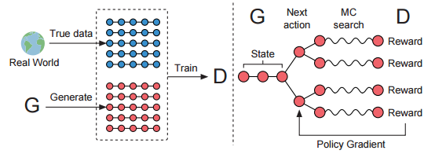
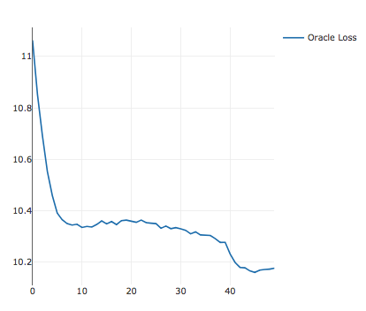

# SeqGAN

> This is basic demo of the **SEQUENCE GAN** 
which is rewrite using PyTorch for personal study.   
The original versioin of the tenensorflow is in [here](https://github.com/LantaoYu/SeqGAN)

# Requirements
PyTorch 0.4.0  
Visdom 0.1.7

# Run
Initialize the Visdom first.  
```  
$ python3 -m visdom.server
```  

Then run by  
```
$ python3 main
```
if using cuda then pass the cuda number.  
```
$ python3 main --cuda=0
```  
Then you can view the training curve in the visdom environment.


# Overview Model


# Learning Curve

> Adversarial training **after 40 epoch** supervised pretrain of the generator.



